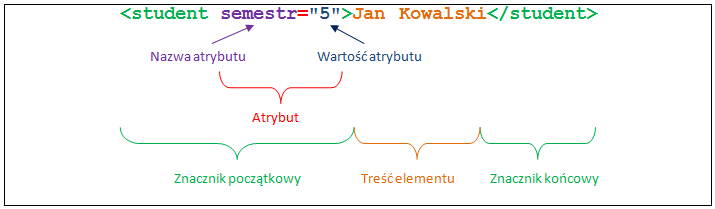

Zadanie 1

# Postolowy świat liczb i literek
| Pojęcie | Definicja |
| --- | --- |
| Bit | znak w alfabecie binarnym/dwójkowym |
| Alfabet |  zbiór znaków |
| Alfabet binarny | składa się z dwóch znaków (bit), jedynka albo zero|
| Składnia | zbiór reguł oznaczające poprawne ciągi znaków - wyrazy/słowa |
| Semantyka | zbiór reguł przypisujących znaczenie do wyrazów/słów - jak rozumieć ciąg znaków|
| Algorytm | wiedza jak rozwiązać problem, przepis na rozwiązanie |
| Język | relacja informacji z danymi, zbiór dopuszczalnych ciągów znaków |
| Język programowania | pozwala formalnie zapisać algorytm.|
| Dane | fizyczna reprezentacja informacji|
| Informacja | abstrkacja, nie da się jej zmierzyć|
| Plik | 1. uporządkowany ciąg bitów, posiadający opis metadane. Składa się z metadanych i strumienia. Uporządkowany zbiór danych.<br> 2. plik posiada początek, długość, koniec i dla każdego bitu znamy jego poprzednik i następnik|
| Nazwa pliku | podstawowy atrybut |
| Serializacja | zmiana postaci danych z obiektowej na strumieniową. Zapis stanu obiektu na strumień bitów |
| Kod | (tekst) język infomacji, którego alfabetem są liczby <br> 
| Kodowanie | znaki i semantyka |

> Piszemy **kod** (tekst) w dowolnym edytorze tekstowym
• **tekst** staje się **programem** po **kompilacji** (sprawdzenie czy nie ma błędów składniowych i
semantycznych, walidacja) -> otrzymujemy **pliki**

# Definicje z wykladu i labolatoriów
| Pojęcie | Definicja |
|---|---|
| XML | *Extensible Markup Language* - (Rozszerzalny Język Znaczników)
| Dokument XML  | Dokument jest ciągiem znaków, jest ciągiem znaczników i tekstu, jest drzewem.|
| Węzeł tekstowy | **liść drzewa** - |
| Element główny | 1. istnieje tylko jeden w dokumencie <br> 2. zawierają się w nim wszystkie pozostałe elementy |
| Element | posiada nazwę, może posiadać treść, elementy, atrybuty lub być pusty:  `<pusty_element/>`|
|Hierarchia elementów| jeden element główny, zawierający pozostałe elementy tworząc **hierarchię**|
| Atrybut | określenie dodatkowych inormacji dla struktur danych |
| Instrukcja przetwarzania| dodatkowe informacje skierowane do parserów |
<br>

# Podstawowe pytania

## *"Czym jest"* XML?
- standard opisany przez W3C (World Wide Web Consortium)
- sposób zapisywania danych wraz z ich strukturą w pliku tekstowym
- język
- metajęzyk - (język służący do opisu innego języka)

> XML opiera się o model dokumentu w postaci drzewa
**węzły** - elementy, **liście** - pola tekstowe

> XML **nie** jest językiem programowania (nie można w nim zapisac algorytmu)

### Przykład XML:
```xml

<?xml version="1.0" encoding="UTF-8"?>
<!DOCTYPE element_główny [ 
  <!ENTITY encja "To jest wartość encji prostej"> 
  <!ENTITY encja2 "To jest wartość encji <podelement>złożonej</podelement>"> 
] > 
<!-- Tu może być komentarz lub instrukcja przetwarzania, ale nie zwykły tekst ani elementy -->
<element_główny> 
   <?instrukcja atrybut="wartość" ale można też tak?> 
   <podelement atrybut='Wartość atrybutu' inny-atrybut="Referencje do encji prostych: &encja; &quot;"> 
      Zawartość tekstowa <elem>i zanurzony element</elem>. 
      <!-- Komentarze i instrukcje dozwolone --> 
      <element_pusty może_mieć="atrybut"/>
   </podelement> 
   Zawartość tekstowa &encja; &#502; 
   &encja2;
   <![CDATA[x < 5 && x > -5]]> 
</element_główny>
<!-- Tu może być komentarz lub instrukcja, 
ale nie zwykły tekst ani elementy -->
```

## *"Po co? "* - Do czego służy XML ?
- do przechowywania lub przesyłanie danych tekstowych wraz z ich strukturą


<br>

# Warstwa logiczna XML

## Elementy

### Co to element?

### Nazwy elementów:
> Nazwy elementów mogą zawierać cyfry, myślniki, dwukropki i kropki, ale nie mogą się od nich zaczyna. Natomiast nazwy mogą zaczynać się od podkreśleń. 
**Nie ma ograniczenia długości nazwy.**

### Rodzaje elementów:
- Zawartość elementowa (zawiera inne elementy):
```xml
<student>
   <FTIMS kierunek="informatyka" /> 
   <EiE kierunek="informatyka" /> 
</student>
```

- Zawartość mieszana (zawiera tekst oraz element):
```xml
<student>
   Jestem studentem PŁ 
   <FTIMS kierunek="informatyka" >Po wyborze specjalizacji </FTIMS>
</student>
```

- Zawartość tekstowa (zawiera sam teskt):
```xml
<student>
  Jestem studentem PŁ
</student>
```
<br>

## Atrybuty

1. Identyfikowany przez nazwe
2. Wartość to **tekst**
3. Musi buc unikalny dla elementu (element nie może zawierać dwóch atrybówów o tej samej nazwie)



> Wartości atrybutów muszą być zawsze umieszczone w cudzysłowach (" ") lub apostrofach (' ').

### Instrukcje przetwarzania
- Składają się z **podmotu (target)** oraz **treści** 
- instrukcje przetwarzania umieszcza się pomiędzy `<? ?>`

#### Przykłady instrukcji przetwarzania:
- określenie wersji języka:
```xml
 <?xml version="1.0" ?>.
```
- określenie wersji wraz z kodowaniem:
```xml
 <?xml version="1.0" encoding="UTF-8" ?>
```
- Podanie informacji o pominięciu (lub nie) przetwarzania zewnętrznych jednostek (np. DTD):
```xml
<?xml version="1.0" standalone="no" ?>
```
- Dołączenie arkusza stylów:
```xml
<?xml-stylesheet href="style.css" type="text/css" ?>
```
- Komentarze:
```xml
<!-- To jest komentarz -->
```
<br>

# Warstwa fizyczna XML
## Encje
### Czym jest encja?
- to spójny ciąg znaków, uogólnione pojęcie pliku

#### predefiniowane encje (5): 
 ` & - &amp;`
 ` < - &lt;`
 ` > - &gt;`
 ` " - &quot;`
 ` ' - &apos;`

> Wlasne encje można definiować w dokumencie DTD
**składnia:** `&encja;`. Parser XML wstawi w miejsce encja zadeklarowaną wartość.

<br>

## Referencje do znaków i CDATA

### Referencje do znaków
Oprócz referencji do encji istnieją referencje do znaków, np. `&#252;` to odwołanie do znaku **ü** o kodzie Unicode 520, a `&#x80;` do znaku **€** o kodzie 128 (0x0080).

### Sekcje CDATA
pozwalają zapisywać w węzłach tekstowych **znaki specjalne** bez stosowania referencji do znaków czy encji. 

Jedynym **zabronionym** w sekcji CDATA ciągiem znaków jest `]]>, który zawsze zamyka sekcję. Ten ciąg znaków jest także zabroniony w zawartości tekstowej dokumentu XML.

# Wersje XML:
## XML 1.0
- Dokument musi zaczynać się od deklaracji XML, aby mógł być traktowany jako dokument XML.
- Dokument posiada tylko jeden element główny (root, korzeń).
Każdy znacznik początkowy musi posiadać odpowiedni znacznik końca (lub wykorzystywany jest format elementu pustego).
- Elementy nie mogą być niewłaściwie zagnieżdżone (nie mogą na siebie zachodzić), wartości atrybutów muszą znajdować się pomiędzy pojedynczymi lub podwójnymi znakami cudzysłowu.
- Nazwy atrybutów wewnątrz elementów nie mogą się powtarzać; element nie może posiadać dwóch atrybutów o takiej samej nazwie.
- Znak < oraz & nie mogą występować jako część zawartości elementu lub jako część wartości atrybutu.
- Komentarze i instrukcje przetwarzania nie mogą występować wewnątrz znaczników.

##  XML 1.1
> W 2004 roku status rekomendacji uzyskała nowa wersja standardu XML: XML 1.1 wraz z nową wersją Namespaces in XML 1.1. 

## Najważniejsze różnice w stosunku do wersji 1.0:

- Oparty o Unicode 4.0 zamiast 2.0, zaprojektowany z myślą o kompatybilności w przód.
- „Czarna lista” znaków zabronionych w nazwach zamiast „białej listy” znaków dozwolonych.
- Dodatkowe znaki końca wiersza: &#x85 i &#x2028.
- Znaki sterujące mogą występować tylko jako referencje, możliwość używania referencji do znaków od #x01 do #x1F (co jest nielegalne w XML 1.0, poza znakami tabulacji i nowego wiersza).
- Możliwość anulowania (undeclare) przestrzeni nazw.
- Identyfikatorami przestrzeni nazw są IRI zamiast URI.
